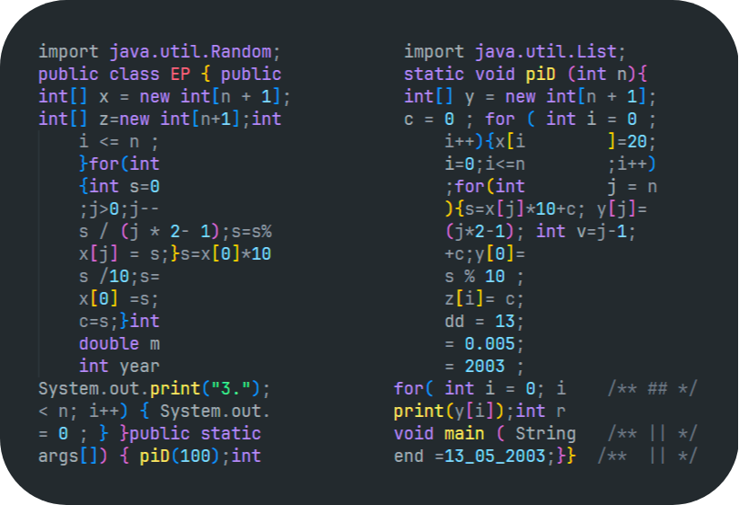

<h1 align="center">Hey World, it's me Eric 👋 !</h1>

    

    <small style="text-align: center;"> <a href="EP.java">Code Fonctionnel</a>, pour déterminer les décimales de PI avec la méthode de Gauss-Legendre </small>

---

 

‎
‎
‎
‎
‎
‎
‎
‎

‎
‎
‎
‎
‎
‎
‎
‎

 

---

I'm a `22-year-old` self-taught developer primarily proficient in `TypeScript`, `JavaScript`, and `Java`, with additional experience in languages such as `Python`, `Julia`, and `C#`. I also specialize in web development, particularly in `Angular` and `React`. Skilled in self-learning and conducting independent research online!

Lover of **music**🎧, **photography** 📷 and **wood work** 🪵

---

Checkout my Portfolio at : https://ericphlpp.com !

---

- 💼 I'm currently working at [`ADP Gsi`](https://www.fr.adp.com) !

- 🕹️ My professional growth trajectory involves delving into various server architectures, notably TCP, for facilitating direct user-to-user communication, with a focus on implementations in C#.

- 🌱  I plan to elevate my proficiency in web styling by immersing myself in tools like `Figma` and undertaking `CSS` courses in order to complements my grasp of web frameworks fostering a comprehensive skill set in web development.

- 🎵 My Current favorite song : **No Good - KALEO**

- 📫 You can contact me on **Discord @zaorhion**

---

Check out my `Social Media` just below !

‎
‎
‎
‎
‎

‎
‎
‎
‎
‎

‎
‎
‎
‎
‎

‎
‎
‎
‎
‎

---

## **My IT Skills :**

## 💻 **Languages -**

 

. . .

---

## 🌐 **Web Development -**

 

. . .

---

## 📦 **Database -**

 

. . .

---

## **⚒️ Tools -**

 

. . .

## **🛜 DevOps -**

 

. . .

---

---

## 👋 Thanks for checking out my profile !! 👋
